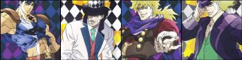
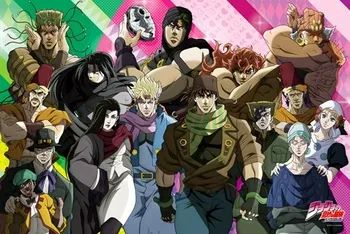
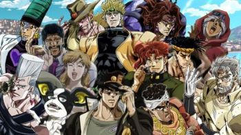
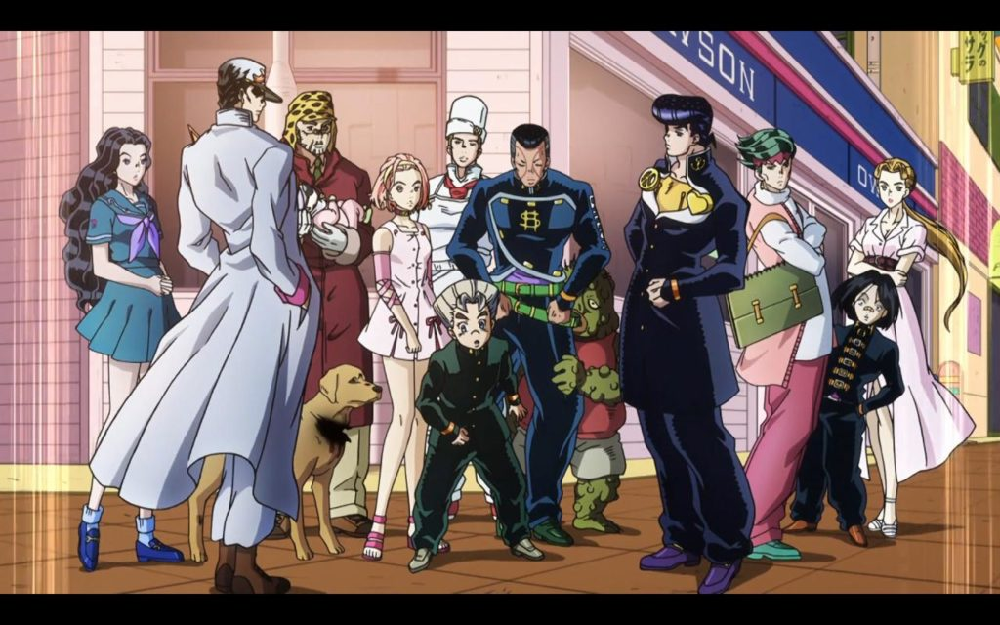
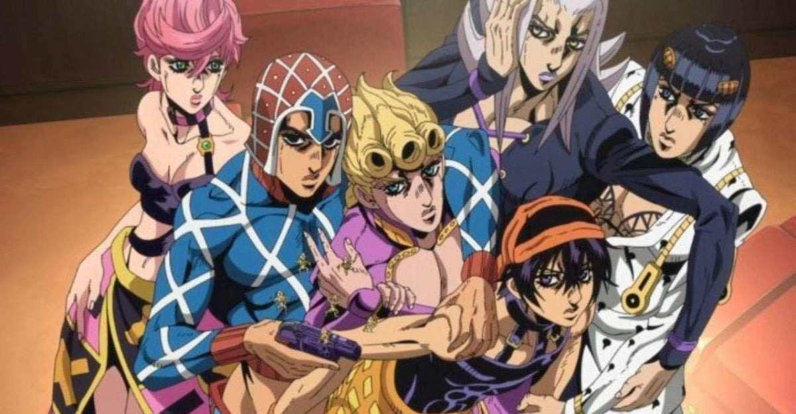
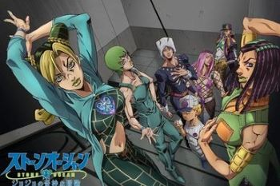

# Jojo's Bizarre Adventures 

* * *

## Introduction  

JoJo's Bizarre Adventure (ジョジョの奇妙な冒険) is a manga by Hirohiko Araki. It was prepublished between 1986 and 2004 in the weekly Weekly Shōnen Jump, and since 2005 in the monthly magazine Ultra Jump. The French version was initially published by J'ai lu from 2002 to 2005, then by Tonkam since 2007. With over 120 million copies in circulation, it's one of the best-selling mangas in the world.

The manga was adapted into a thirteen-episode OVA series produced by Studio APPP in the 1990s and 2000s, retracing part of the third part of the manga. A new animated TV series produced by David Production has been airing since October 2012, adapting the first six parts. 

The story centers on the Joestar family and spans several generations, from the 19th century to the present day. Each arc of the series features a "Jojo" (except in arc 5), with all the characters in the family having a first name beginning with -Jo. In the course of their adventures, the protagonists evolve in different countries: England, USA, Japan, India, Pakistan, Egypt, ... 

I've chosen to focus on the first 6 parts of the manga, even though it has 9, as they've already been adapted into anime. 

* * *

## Characters 

As I said earlier, each part is centered on a character from the Joestar family (with the exception of part 5), and they all have a star-shaped birthmark near their left shoulder that shows they belong to this family. As it can be a bit tricky to find your way around, I've created a family tree of theirs so you can find your way around.

[family tree](english/arbreg-fr_fr-en_us-T-C.md)

>**Names written in bold are the names of characters who appear in an earlier part.**
>
>*Names in italics are the names of antagonists.*

### Part 1 (Phantom Blood): 

Notable personalities : 

- Jonathan Joestar

- George Joestar

- Erina Pendleton

- Will Anthonio Zeppeli

- Robert E.O. Speedwagon

- *Dio Brando*

### Part 2 (Battle Tendency): 

Notable personalities : 

- Joseph Joestar

- **Erina Pendleton**

- **Robert E.O. Speedwagon**

- Lisa Lisa 

- Caesar Antonio Zeppeli

- Rudolf von Stroheim

- Suzie Q

- *Santana* 

- *ACDC*

- *Wamuu*

- *Kars*

### Part 3 (Stardust Crusaders): 

Notable personalities : 

- Jotaro Kujo

- Holy Kujo

- **Joseph Joestar**

- Mohammed Abdul	

- Noriaki Kakyoin

- Jean-Pierre Polnareff

- Iggy

- *Oingo*

- *Boingo* 

- *Hol Horse*

- ***Dio Brando***

### Part 4 (Diamond is Unbreakable): 

- Josuke Higashikata	

- **Jotaro Kujo**

- Koichi Hirose

- Tomoko Higashikata

- Okuyasu Nijimura

- Rohan Kishibe

- **Joseph Joestar**

- *Kira Yoshikage*

### Part 5 (Golden Wind): 

- Giorno Giovanna

- Bruno Bucciarati

- **Koichi Hirose**

- Narancia Ghirga

- Mista Guido

- Abbacchio Leone

- Trish Una

- Fugo Pannacotta

- **Jean-Pierre Polnareff**

- *Doppio Vinegar*

- *Diavolo*

### Part 6 (Stone Ocean):

- Jolyne Kujo

- **Jotaro Kujo**

- Ermes Costello

- F.F.

- Emporio Alnino

- Anasui Narciso

- Weather Report

- *Enrico Pucci*

- Green Baby Green baby is not really an antagonist, since he's a baby and not really aware of his actions, but he does represent a threat to Jolyne and her companions.

* * *

## Music 

One of the things I particularly like about this manga is that it's packed with musical references, which can be found in: - the names of the antagonists/secondary characters - the names of the characters' powers (from part 3 onwards)

This makes the manga a very culturally rich work, since it mentions over 200 different artists and musical styles. Here you can find a ~~complete~~ list (no, that would have taken too long), of some of the artists who can be found there. 

[Table of musical references](english/tableau-fr_fr-en_us-T-C.md)

* * *

## Collaborations 

Not just a reference for manga fans, Jojo's Bizarre Adventures is also well known in the fashion world, with designer Hirohiko Araka having collaborated with Converse and Vans, as well as haute-couture brands such as Gucci, Seiko and Balenciaga.  

Converse - Vans - Gucci - Balenciaga - Seiko

Other brand collaborations have included LG and Mercedes. 

LG - Mercedes

The artist has also collaborated with art galleries such as the National Arts Centre in Tokyo, which devoted an exhibition to him on the occasion of the 30th anniversary of his work, and with the Louvre for the "Le Louvre invite la bande dessinée" event. 

* * *

## Manga (to go further) 

As I said earlier, the Jojo's Bizarre Adventures manga is made up of 9 arcs (for the moment). Each part consists of several volumes: 

- Phantom Blood > 5 volumes

- Battle Tendency > 7 volumes 

- Stardust Crusaders > 16 volumes 

- Diamond is Unbreakable > 18 volumes 

- Golden Wind > 17 volumes 

- Stone Ocean > 17 volumes 

- Steel Ball Run > 24 volumes 

- Jojolion > 27 volumes 

- Jojoland > 4 volumes (in progress)

`To conclude, I'd like to add that One Piece is often referred to as one of the longest mangas (which isn't true!) In reality, although its anime adaptation has over 1,000 episodes - compared with just 190 for Jojo - One Piece is "only" 106 volumes long (around 23,000 pages), compared with 132 volumes (around 25,000 pages) for Jojo's Bizarre Adventures.`

© I don't own the images displayed on this blog, all rights reserved to the rights holders, I'm just using them as part of a non-profit university project. 
