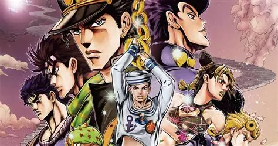

# Jojo's Bizarre Adventures 

## Introduction  

JoJo's Bizarre Adventure (ジョジョの奇妙な冒険) est un manga de Hirohiko Araki. Il est prépublié entre 1986 et 2004 dans l'hebdomadaire Weekly Shōnen Jump, puis depuis 2005 dans le magazine mensuel Ultra Jump. La version française est initialement publiée par J'ai lu de 2002 à 2005, puis par les éditions Tonkam depuis 2007.
Avec plus de 120 millions d'exemplaires en circulation, c'est l'un des mangas les plus vendus au monde.

Le manga est adapté en une série d'OAV de treize épisodes produite par Studio APPP dans les années 1990 et 2000, qui retrace une partie de la troisième partie du manga. Une nouvelle série télévisée d'animation produite par David Production est diffusée depuis octobre 2012 et adapte les six premières parties. 

L'histoire est centrée sur la famille Joestar et s'étend sur plusieurs générations allant du XIXe siècle jusqu'à de nos jours. 
Chaque arc de la série met en avant un "Jojo" (sauf dans l'arc 5), tous les personnages de la famille ayant un prénom commençant par -Jo et un nom de famille contenant la syllabe -Jo. 
Au cours de leurs aventures, les protagonistes évoluent dans différents pays : Angleterre, Etats-Unis, Japon, Inde, Pakistan, Egypte, ... 

## Musique 

Une des choses que j'apprécie particulièrement dans ce manga est qu'il est truffé de références musicales, ces références peuvent se trouver dans : 
- le nom des antagonistes / personnages secondaires
- le nom des pouvoirs des personnages (à partir de la partie 3)

[Tableau des références musicales](pages/tableau.md) : 

## Collaborations 

Ce manga n'est pas seulement une référence pour les amateurs de manga, Jojo's Bizarre Adventures est également très connu dans le milieu de la mode, son dessinateur, Hirohiko Araka a notemment collaboré avec Converse et Vans mais aussi avec des marques de haute-couture telles que Gucci, Seiko ou encore Balenciaga.  

[Converse](https://www.google.com/url?sa=i&url=https%3A%2F%2Fjojo-news.com%2F2022%2F01%2F28%2Fjojos-bizarre-adventure-x-converse-returns-with-stone-ocean-sneakers%2F&psig=AOvVaw2Y4JsOz53WcRpeeqbGmxKX&ust=1727188118002000&source=images&cd=vfe&opi=89978449&ved=0CBQQjRxqFwoTCJCwvKOj2YgDFQAAAAAdAAAAABAE) - [Vans](https://www.google.com/url?sa=i&url=https%3A%2F%2Fjojowiki.com%2FJoJo%2527s_Bizarre_Adventure_Golden_Wind_%25C3%2597_VANS&psig=AOvVaw04UPYGpMcd0YZJdAeshSz-&ust=1727188857691000&source=images&cd=vfe&opi=89978449&ved=0CBQQjRxqFwoTCJCYgIem2YgDFQAAAAAdAAAAABAE) - [Gucci](https://jojo.fandom.com/wiki/Gucci_X_Hirohiko_Araki_X_Spur) - [Balenciaga](https://www.google.com/url?sa=i&url=https%3A%2F%2Fwww.animenewsnetwork.com%2Finterest%2F2018-08-17%2Fjojo-bruno-bucciarati-poses-in-balenciaga-for-magazine-cover%2F.135589&psig=AOvVaw0E3AHn6USgVYkNK_D5X9z4&ust=1727188621963000&source=images&cd=vfe&opi=89978449&ved=0CBQQjRxqFwoTCMjiyJal2YgDFQAAAAAdAAAAABAE) - [Seiko](https://www.google.com/url?sa=i&url=https%3A%2F%2Fjojowiki.com%2FSeiko_%25C3%2597_JoJo&psig=AOvVaw2ynsm7-IgdjnDpYBXd1cm2&ust=1727189007286000&source=images&cd=vfe&opi=89978449&ved=0CBQQjRxqFwoTCPCSz8um2YgDFQAAAAAdAAAAABAE)

D'autres collaborations avec des marques ont pu avoir lieu comme par exemple avec LG ou Mercedes. 

[LG](https://jojowiki.com/JOJO_L-02K) - [Mercedes](https://www.animenewsnetwork.com/interest/2018-08-31/jojo-bizarre-adventure-exhibit-promotions-take-over-tokyo/.136065)

L'artiste a également collaboré avec des galeries d'art telles que le Centre National des Arts de Tokyo qui lui a consacré une exposition à l'occasion de l'anniversaire des 30 ans de son oeuvre mais aussi avec le Louvres lors de l'évènement __"Le Louvre invite la bande dessinée"__. 

| Titre 1    | Titre 2    | Titre 3    |
|------------|------------|------------|
| Contenu 1  | Contenu 2  | Contenu 3  |
| Contenu 4  | Contenu 5  | Contenu 6  |                             

                                                          
