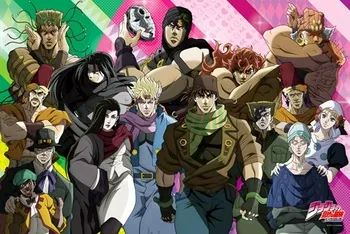
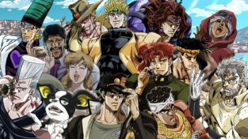
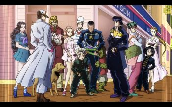
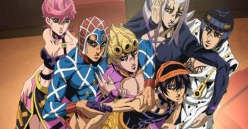
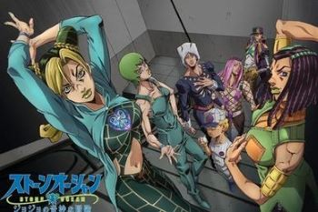

# Jojo's Bizarre Adventures 

* * *

## Introduction  

JoJo's Bizarre Adventure (ジョジョの奇妙な冒険) est un manga de Hirohiko Araki. Il est prépublié entre 1986 et 2004 dans l'hebdomadaire Weekly Shōnen Jump, puis depuis 2005 dans le magazine mensuel Ultra Jump. La version française est initialement publiée par J'ai lu de 2002 à 2005, puis par les éditions Tonkam depuis 2007.
Avec plus de 120 millions d'exemplaires en circulation, c'est l'un des mangas les plus vendus au monde.

Le manga est adapté en une série d'OAV de treize épisodes produite par Studio APPP dans les années 1990 et 2000, qui retrace une partie de la troisième partie du manga. Une nouvelle série télévisée d'animation produite par David Production est diffusée depuis octobre 2012 et adapte les six premières parties. 

L'histoire est centrée sur la famille Joestar et s'étend sur plusieurs générations allant du XIXe siècle jusqu'à de nos jours. 
Chaque arc de la série met en avant un "Jojo" (sauf dans l'arc 5), tous les personnages de la famille ayant un prénom commençant par -Jo. 
Au cours de leurs aventures, les protagonistes évoluent dans différents pays : Angleterre, Etats-Unis, Japon, Inde, Pakistan, Egypte, ... 

J'ai choisi de me centrer sur les 6 premières parties du manga bien que celui-ci en possède 9 car elles ont déjà été adaptées en animé. 

* * *

## Personnages 

Comme je l'ai dit précédemment, chaque partie est centrée sur un personnage faisant partie de la famille Joestar (à l'exception de la partie 5), ils possèdent d'ailleurs tous une tâche de naissance en forme d'étoile près de leur épaule gauche qui montre l'appartenance à cette famille. Comme cela peut-être un peu compliqué de s'y retrouver, j'ai créé un arbre généalogique de leur famille afin que vous puissiez vous y retrouver.

[arbre généalogique](pages/arbreg.md)

>**Les noms écrits en gras sont les noms des personnages qui sont présents dans une partie antérieure**
>
>*Les noms écrits en italiques sont les noms des antagonistes.*

### Partie 1 *(Phantom Blood)*: 

Personnages notables : 

- Jonathan Joestar

- George Joestar

- Erina Pendleton

- Will Anthonio Zeppeli

- Robert E.O. Speedwagon

- *Dio Brando*

### Partie 2 *(Battle Tendency)*: 

Personnages notables : 

- Joseph Joestar

- **Erina Pendleton**

- **Robert E.O. Speedwagon**

- Lisa Lisa 

- Caesar Antonio Zeppeli

- Rudolf von Stroheim

- Suzie Q

- *Santana* 

- *ACDC*

- *Wamuu*

- *Kars*

### Partie 3 *(Stardust Crusaders)*: 

Personnages notables : 

- Jotaro Kujo

- Holy Kujo

- **Joseph Joestar**

- Mohammed Abdul	

- Noriaki Kakyoin

- Jean-Pierre Polnareff

- Iggy

- *Oingo*

- *Boingo* 

- *Hol Horse*

- ***Dio Brando***

### Partie 4 *(Diamond is Unbreakable)*: 

- Josuke Higashikata	

- **Jotaro Kujo**

- Koichi Hirose

- Tomoko Higashikata

- Okuyasu Nijimura

- Rohan Kishibe

- **Joseph Joestar**

- *Kira Yoshikage*

### Partie 5 *(Golden Wind)*: 

- Giorno Giovanna

- Bruno Bucciarati

- **Koichi Hirose**

- Narancia Ghirga

- Mista Guido

- Abbacchio Leone

- Trish Una

- Fugo Pannacotta

- **Jean-Pierre Polnareff**

- *Doppio Vinegar*

- *Diavolo*

### Partie 6 *(Stone Ocean)*:

- Jolyne Kujo

- **Jotaro Kujo**

- Ermes Costello

- F.F.

- Emporio Alnino

- Anasui Narciso

- Weather Report

- *Enrico Pucci*

- *Green Baby* `Green baby n'est pas rééllement un antagoniste puisqu'il s'agit d'un bébé et qu'il n'est pas rééllement conscient de ses actions cependant il représente une menace pour Jolyne et ses compagnons.`

* * *

## Musique 

Une des choses que j'apprécie particulièrement dans ce manga est qu'il est truffé de références musicales, ces références peuvent se trouver dans : 
- le nom des antagonistes / personnages secondaires
- le nom des pouvoirs des personnages (à partir de la partie 3)

Cela fait de ce manga une oeuvre très riche culturellement puisqu'il mentionne plus de 200 artistes ou musiques différentes. 
Ici, vous pouvez trouver une liste ~~complète~~ (non, ça aurait pris trop de temps), de certains des artistes qu'on peut y retrouver. 

[Tableau des références musicales](pages/tableau.md) : 

* * *

## Collaborations 

Ce manga n'est pas seulement une référence pour les amateurs de manga, Jojo's Bizarre Adventures est également très connu dans le milieu de la mode, son dessinateur, Hirohiko Araka a notemment collaboré avec Converse et Vans mais aussi avec des marques de haute-couture telles que Gucci, Seiko ou encore Balenciaga.  

[Converse](https://www.google.com/url?sa=i&url=https%3A%2F%2Fjojo-news.com%2F2022%2F01%2F28%2Fjojos-bizarre-adventure-x-converse-returns-with-stone-ocean-sneakers%2F&psig=AOvVaw2Y4JsOz53WcRpeeqbGmxKX&ust=1727188118002000&source=images&cd=vfe&opi=89978449&ved=0CBQQjRxqFwoTCJCwvKOj2YgDFQAAAAAdAAAAABAE) - [Vans](https://www.google.com/url?sa=i&url=https%3A%2F%2Fjojowiki.com%2FJoJo%2527s_Bizarre_Adventure_Golden_Wind_%25C3%2597_VANS&psig=AOvVaw04UPYGpMcd0YZJdAeshSz-&ust=1727188857691000&source=images&cd=vfe&opi=89978449&ved=0CBQQjRxqFwoTCJCYgIem2YgDFQAAAAAdAAAAABAE) - [Gucci](https://jojo.fandom.com/wiki/Gucci_X_Hirohiko_Araki_X_Spur) - [Balenciaga](https://www.google.com/url?sa=i&url=https%3A%2F%2Fwww.animenewsnetwork.com%2Finterest%2F2018-08-17%2Fjojo-bruno-bucciarati-poses-in-balenciaga-for-magazine-cover%2F.135589&psig=AOvVaw0E3AHn6USgVYkNK_D5X9z4&ust=1727188621963000&source=images&cd=vfe&opi=89978449&ved=0CBQQjRxqFwoTCMjiyJal2YgDFQAAAAAdAAAAABAE) - [Seiko](https://www.google.com/url?sa=i&url=https%3A%2F%2Fjojowiki.com%2FSeiko_%25C3%2597_JoJo&psig=AOvVaw2ynsm7-IgdjnDpYBXd1cm2&ust=1727189007286000&source=images&cd=vfe&opi=89978449&ved=0CBQQjRxqFwoTCPCSz8um2YgDFQAAAAAdAAAAABAE)

D'autres collaborations avec des marques ont pu avoir lieu comme par exemple avec LG ou Mercedes. 

[LG](https://jojowiki.com/JOJO_L-02K) - [Mercedes](https://www.animenewsnetwork.com/interest/2018-08-31/jojo-bizarre-adventure-exhibit-promotions-take-over-tokyo/.136065)

L'artiste a également collaboré avec des galeries d'art telles que le Centre National des Arts de Tokyo qui lui a consacré une exposition à l'occasion de l'anniversaire des 30 ans de son oeuvre mais aussi avec le Louvres lors de l'évènement __"Le Louvre invite la bande dessinée"__. 

* * *

## Manga (pour aller plus loin) 

Comme je l'ai dit précédemment, le manga Jojo's Bizarre Adventures est composé de 9 arcs (pour le moment). 
Chaque partie est composée de plusieurs tomes : 

- Phantom Blood > 5 tomes

- Battle Tendency > 7 tomes 

- Stardust Crusaders > 16 tomes 

- Diamond is Unbreakable > 18 tomes 

- Golden Wind > 17 tomes 

- Stone Ocean > 17 tomes 

- Steel Ball Run > 24 tomes 

- Jojolion > 27 tomes 

- Jojoland > 4 tomes *(en cours)*

`Pour conclure j'aimerais ajouter qu'on mentionne souvent One Piece comme étant l'un des mangas les plus longs (ce qui est faux !) en réalité, bien que son adaptation en anime comporte plus de 1000 épisodes - face à seulement 190 pour Jojo - One Piece n'est composé "que" de 106 tomes (environ 23 000 pages) face à 132 tomes (environ 25 000 pages) pour Jojo's Bizarre Adventures.`

© Je ne possède pas les images affichées sur ce blog, tous droits réservés aux ayants droits, je les utilise juste dans le cadre d'un projet universitaire à but non lucratif. 
